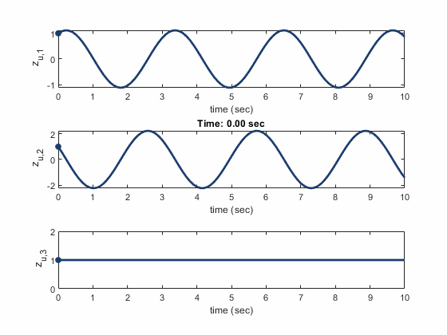
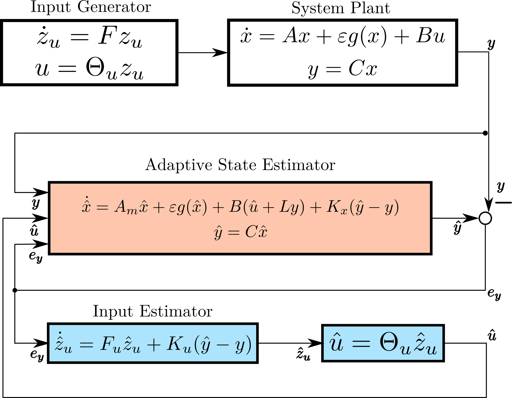
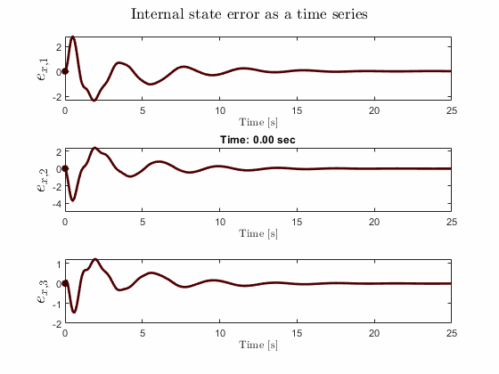
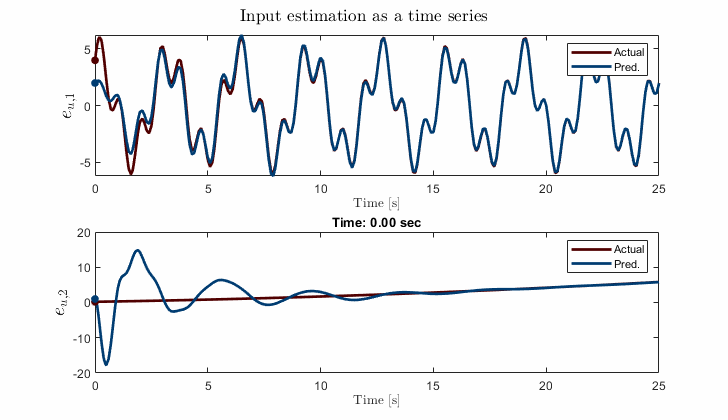
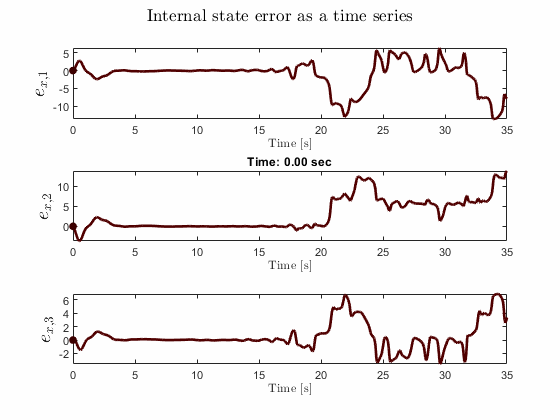
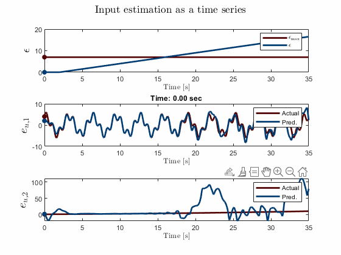

<!-- .slide: data-background="#500000" class="dark" -->

# Adaptive Estimation of Unknown Inputs with Weakly Nonlinear Dynamics

## T. Griffith, V. Gehlot, M. Balas
#### ACC 2022

#### June 8, 2022

---

<section>
<h1> Adaptive Unknown Input Estimators </h1>
<h2> Estimator overview </h2>

<dl>
<dt>Three significant uncertainties</dt>
  <dd>- Input $u$ is unknown, external</dd>
  <dd>- State matrix $A$ may have uncertainty</dd>
  <dd>- Known, Lipschitz nonlinear internal dynamics $g(x)$</dd>
<dt>Can we synthesize $u$ and correct $A$?</dt>
</dl> 

\begin{aligned}
    \dot{x}&=Ax+g(x)+Bu\\\
    y&=Cx
\end{aligned}

</section>

<section>
<h1> Adaptive Unknown Input Estimators </h1>
<h2> Modeling unknown inputs </h2>

<dl>
<dt>Approximate input space $\mathbb{U}$</dt>
  <dd>- $\hat{u}=\sum_{i=1}^{N} c_i f_i(t)$</dd>
<dt>Persisten Inputs</dt>
  <dd>- $\dot{z}_u=F_u z_u$</dd>
  <dd>- $\hat{u}=\Theta_u z_u$</dd>
  <dd>- $F_u = \begin{bmatrix} 0 & 1 & 0 \\\ -\omega^2 & 0 & 0 \\\ 0 & 0 & 0 \end{bmatrix}$</dd>
</dl> 

<figure>
  
</figure>

</section>

<section>
<h1> Adaptive Unknown Input Estimators </h1>
<h2> Architecture and estimator error </h2>

<figure>
  
</figure>

Recover $A$ with adaptive scheme
`$$ A \equiv A_m +B L_{*} C $$`
`$$ \dot{L} = -e_y y^* \gamma_e; \ \gamma_e > 0 $$`
 
Error dynamics

`$$ \dot{e}=(\bar{A}+\bar{K} \bar{C})e+\bar{B} \Delta L y +\varepsilon \Delta g $$`

`$$ \begin{bmatrix} \dot{e}_x \\\ \dot{e}_z \end{bmatrix} = \underbrace{\begin{bmatrix} A_m+K_x C & B \Theta_u \\\ K_u C & F \end{bmatrix}}_\text{$\bar{A}_c$} \begin{bmatrix} e_x \\\ e_z \end{bmatrix} +\begin{bmatrix} B \\\ 0 \end{bmatrix} w +\varepsilon\begin{bmatrix} g(\hat{x})-g(x) \\\ 0 \end{bmatrix}$$`

</section>

<section>
<h1> Adaptive Unknown Input Estimators </h1>
<h2> Architecture and estimator error </h2>

 <ul>
  <li>ASD plant dynamics</li>
  <li>$A$ Hurwitz</li>
  <li>Bounded `$L_{*}$`</li>
  <li>Error in state and input converges to zero
    <ul>
      <li>`$V(e,\Delta L) = \frac{1}{2}e^*\bar{P}e+\frac{1}{2}\text{tr}(\Delta L \gamma_e^{-1} \Delta L^*)$`</li>
      <li>`$\dot{V}(e, \Delta L)\leq -\Big(\underbrace{\frac{1}{2}\lambda_{\text{min}}(\bar{Q})-\varepsilon \mu\lambda_{\text{max}}(\bar{P})}_{\bar{\alpha}>0}\Big)||e||^2$`</li>
    </ul>
  </li>
</ul> 
 

 `\begin{align} 0<\varepsilon <\frac{\lambda_{\text{min}}(\bar{Q})}{2 \mu \lambda_{\text{max}}(\bar{P})}\Longleftrightarrow \bar{\alpha}>0. \end{align}`

</section>

---

<!-- .slide: data-background="#ffffff" class="light" -->

<section>

<h1> Illustrative example</h1>

\begin{align}
\dot{x}&=A_m x+\varepsilon g(x)+Bu\\\
&=\begin{bmatrix}
-4 &1 &2\\\
-1 & -1 & 1\\\
-1 & 1 &-1 
\end{bmatrix}x+ \sin(x)+B u \\\
y&=Cx
\end{align}

\begin{align}
\dot{x}&=A x+\varepsilon g(x)+Bu\\\
&=\begin{bmatrix}
-2.86 &1 &4.7\\\
1.8 & -1 & 6.7\\\
-9 & 1 &-1 7.2
\end{bmatrix}x+ \sin(x)+B u \\\
y&=Cx
\end{align}
 

 
`\begin{align}
L*=\begin{bmatrix}
-8 & 1\\\
2 & -7
\end{bmatrix}
\end{align}`

`\begin{align}
u_1(t)&=c_{11} \sin(2t)+ c_{12} \cos(2t) + c_{13} \sin(7t) + c_{14} \cos(7t)
\end{align}`
`\begin{align}
u_2(t)&=c_{11} +c_{22}t+c_{23}t^2+c_{24}t^3
\end{align}`

</section>

<section>

<h1> Illustrative example</h1>
<h3> Both the state error and the input error converge simultaneously </h3>

<figure>
  
</figure>

<figure>
  
</figure>

</section>

<section>

<h1> Illustrative example</h1>
<h3> provided $\epsilon$ is not too great </h3>

 `$0 < \epsilon < \frac{\lambda_{\min}(\bar{Q})}{2 \mu \lambda_{\max}(\bar{P})}$` 

<figure>
  
</figure>

<figure>
  
</figure>

</section>

---

<section>

<h1> Application: Biomarker dynamics </h1>

<h3> Kalman filtering </h3>
<figure>
  
</figure>

<h3> aUIO  </h3>
<figure>
  
</figure>

</section>

